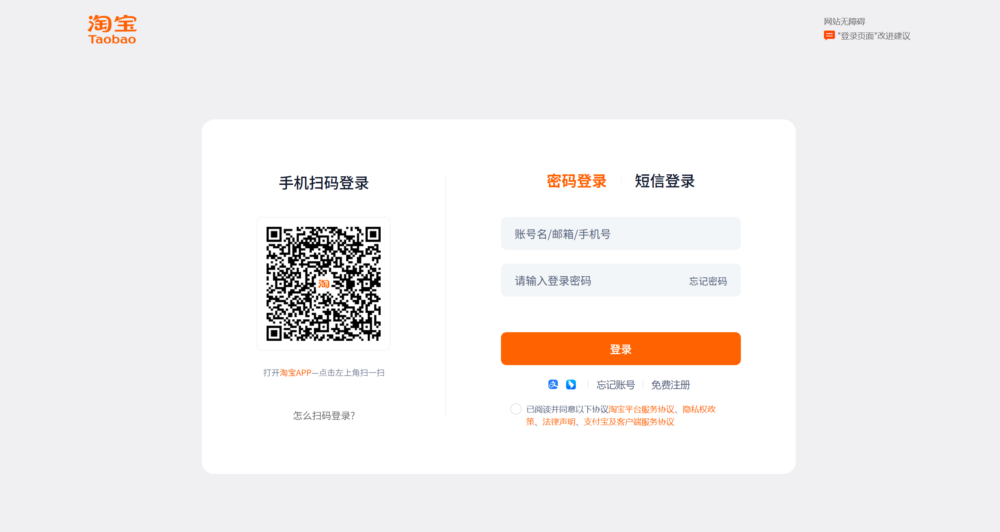

### **淘贝平台用户登录功能需求点**

#### **1. 总体目标与概述**

- **核心功能**：为用户提供多种安全、便捷的登录方式，包括扫码登录、密码登录和短信登录，确保用户可快速安全地访问其账户。
- **核心要素**：登录流程应支持多种账号类型（手机号、邮箱、用户名），集成扫码快捷登录，并提供清晰的错误提示和用户引导。

#### **2. 页面整体布局与通用元素**

- **2.1. 整体风格**：页面设计与示意图保持一致，简洁明了，突出登录入口。  
  

- **2.2. 顶部导航区**

  - **2.2.1. Logo**：
    - **UI**：页面左上角展示“淘贝 Logo”。
    - **行为**：点击 Logo 可跳转至淘贝首页。

#### **3. 主体登录方式选择与表单区**

- **3.1. 扫码登录（默认推荐）**

  - **UI**：
    - 页面中央显示一个大尺寸的二维码区域，下方配有文字提示：“手机扫码登录”。
    - 提示语：“打开淘贝 APP—点击左上角扫一扫”。
    - 提供“怎么扫码登录？”帮助链接，点击可展开常见问题解答。
  - **行为**：
    - 页面加载时自动生成并刷新二维码。
    - 用户使用淘贝 APP 扫描二维码后，自动完成登录并跳转至首页或用户中心。

- **3.2. 切换登录方式**

  - **UI**：在扫码登录区域下方提供选项卡式导航：“密码登录”和“短信登录”。
  - **行为**：点击选项卡可切换至对应的登录表单。

- **3.3. 密码登录表单**

  - **账号输入**：
    - **UI**：输入框占位符提示：“账号名/邮箱/手机号”。
    - **校验**：实时校验输入内容格式，如格式错误提示：“请输入有效的手机号/邮箱/用户名”。
  - **密码输入**：
    - **UI**：密码类型输入框，占位符提示：“请输入登录密码”。
    - **行为**：提供“眼睛”图标，支持明文/密文切换。
  - **忘记密码**：
    - **UI**：在密码输入框右侧提供“忘记密码”链接。
    - **行为**：点击跳转至密码找回流程。
  - **登录按钮**：
    - **UI**：主按钮样式，文字为“登录”。
    - **状态**：初始为不可点击（置灰），当账号和密码均非空时变为可点击。
    - **行为**：点击后提交表单，进行后端验证。验证失败时在对应位置提示错误（如“账号或密码错误”）。

- **3.4. 短信登录表单**
  - **手机号输入**：
    - **UI**：输入框提示：“请输入手机号”。
    - **校验**：实时校验手机号格式。
  - **验证码输入**：
    - **UI**：输入框提示：“请输入短信验证码”，右侧附“获取验证码”按钮。
    - **行为**：
      - 手机号格式正确时，“获取验证码”按钮可点击。
      - 点击后发送短信，按钮进入 60 秒倒计时。
      - 倒计时结束后恢复“重新获取”。
  - **登录按钮**：
    - 同密码登录，需手机号和验证码均非空时才可点击。
    - 提交后校验验证码有效性。

#### **4. 协议与辅助功能**

- **4.1. 服务协议提示**

  - **UI**：页面底部小号灰色文字提示：“已阅读并同意《淘贝平台服务协议》、《隐私权政策》、《法律声明》、《支付宝及客户端服务协议》”。
  - **行为**：协议名称均为超链接，点击可查看详情。

- **4.2. 辅助选项**
  - **UI**：提供“网站无障碍”入口，支持视觉辅助功能。
  - **行为**：点击可启用无障碍浏览模式。

#### **5. 其他登录方式**

- **5.1. 第三方登录**

  - **UI**：在表单下方提供“使用支付宝登录”图标入口。
  - **行为**：点击后跳转至支付宝授权登录流程。

- **5.2. 账号帮助**
  - **UI**：提供“忘记账号”链接，位于登录按钮下方。
  - **行为**：点击进入账号找回流程。

---
