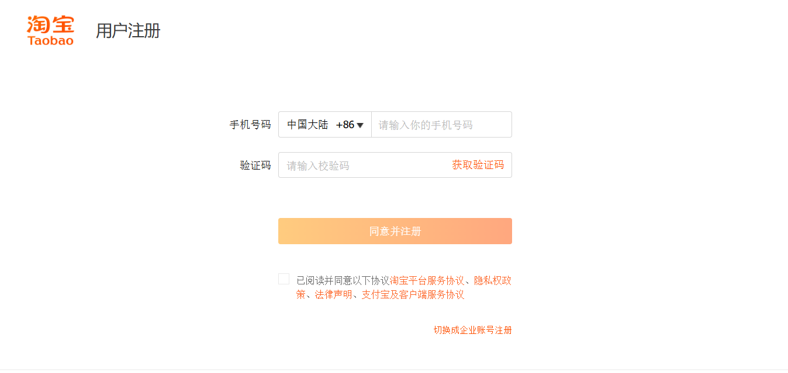

### **淘贝平台用户注册功能需求点**

#### **1. 总体目标与概述**

- **核心功能**: 为用户提供一个清晰、友好的注册流程，用户可以通过**手机号**完成账户创建。
- **核心要素**: 注册流程必须包含手机号验证、用户名设置、密码设置以及同意服务协议等关键步骤。

#### **2. 页面整体布局与通用元素**

- **2.1. 整体风格**: 页面设计与图中保持一致。
- **2.2. 顶部导航区**
  - **2.2.1. Logo**:
    - **UI**: 页面左上角展示“淘贝 Logo”，Logo 旁边为“用户注册”标题。
    - **行为**: 点击 Logo 后，页面跳转至淘贝首页。
  - **2.2.2. 登录入口**:
    - **UI**: 页面右上角显示文字链接：“已有账号？请登录”。
    - **行为**: 点击该链接后，页面跳转至登录页面（暂时不用实现登录页面）。
  - **2.2.3. 注册表单**
    - **UI**: 页面中部为一个居中的表单容器，包含手机号输入、短信验证码输入、用户名设置、密码设置以及同意服务协议等字段。
    - **布局**: 表单字段垂直排列，每个字段之间有一定的间距。
- **2.3. 页脚区域**
  - **UI**: 页面底部应包含标准的页脚信息（如公司信息、备案号、版权声明等）。

#### **3. 主体注册表单区**

- **3.1. 表单标题**:

  - **UI**: 表单顶部需有明确的标题：“欢迎注册淘贝”。

- **3.2. 国家/地区选择**

  - **UI**: 使用下拉选择框。
  - **默认值**: 默认选中并显示“中国 (+86)”。

- **3.3. 手机号码输入 (核心标识)**

  - **UI**:
    - 使用文本输入框，占位符提示文字为“请输入您的手机号”。
    - 输入框左侧应显示当前国家/地区的区号，并与“国家/地区选择”下拉框联动。

- **3.4. 短信验证码**

  - **UI**: 使用文本输入框，占位符提示文字为“请输入短信验证码”。右侧为“获取验证码”按钮。
  - **“获取验证码”按钮**:
    - **初始状态**: 按钮文字为“获取验证码”，可点击。
    - **点击条件**: 仅当前端验证手机号格式正确时，该按钮才可点击。
    - **点击行为**:
      - **前端校验**: 校验手机号格式是否正确，若格式错误，在输入框下方实时显示红色错误提示，如“手机号格式不正确”。
      - **后端校验**: 校验该手机号是否已被注册，若已注册，提示“该手机号已注册，请直接登录”。
      - **发送验证码**: 向已填写的手机号发送一条 6 位的数字验证码短信（可模拟）。
      - **UI 变化**: 按钮变为不可点击状态，文字变为 60 秒倒计时，例如“59s 后重新获取”。
      - **发送失败处理**: 若因网络、频控等原因发送失败，应给予用户明确的弹窗提示，如“验证码发送失败，请稍后重试”。
    - **倒计时结束**: 60 秒倒计时结束后，按钮恢复可点击状态，文字变为“重新获取验证码”。

- **3.5. 用户名设置**

  - **UI**: 使用文本输入框，占位符提示文字为“请设置用户名”。
  - **前端校验**:
    - **实时校验**: 在用户输入完成后，检查用户名的长度、是否包含非法字符。
    - **错误提示**: 若格式不符合要求，应提示：“请输入至多 20 个字符”或“用户名包含非法字符”。

- **3.6. 登录密码设置**

  - **UI**:
    - 使用密码类型输入框（输入内容显示为密文），占位符提示文字为“请设置登录密码”。
    - 输入框下方需有小号灰色文字说明密码规则：“密码需同时包含字母和数字，且长度在 6-20 个字符之间。”
    - 输入框右侧提供一个“眼睛”图标，点击可切换密码的明文/密文显示状态。
  - **前端验证**:
    - **实时强度校验**: 实时验证输入内容是否满足“字母+数字，6-20 个字符”的规则。
    - **强度反馈**: 可通过颜色条或文字动态显示当前密码的强度（弱、中、强）。
    - **错误提示**: 若格式不符合要求，应提示：“密码格式错误，请输入 6-20 个字符，包含字母和数字”。

- **3.7. 协议与注册按钮**

  - **UI**:
    - 包含一个复选框和协议文字：“同意《淘贝平台服务协议》、《隐私权政策》”。
    - 协议名称部分应为超链接。
  - **行为**:
    - **协议查看**: 点击协议名称链接，可跳转至对应的协议详情页或以弹窗形式展示。
    - **勾选**: 必须勾选此项才能进行注册。
  - **“同意协议并注册”按钮**:
    - **UI**: 页面主操作按钮，设计应醒目突出。
    - **状态管理**:
      - **不可点击状态 (默认)**: 按钮置灰，不可点击。
      - **可点击状态**: 当手机号格式、密码格式、用户名格式通过前端校验，验证码不为空，**并且**协议复选框被勾选时，按钮自动变为高亮（品牌主题色，如橙色），并可点击。
    - **提交行为**:
      - **后端校验**:
        - **验证码校验**:
          - **校验逻辑**: 验证用户输入的验证码是否正确、是否在有效期内。
          - **错误提示**: 若验证码错误或过期，在验证码输入框下方显示红色错误提示，如“验证码错误”或“验证码已过期，请重新获取”。
        - **用户名校验**:
          - **唯一性校验**: 检查用户名是否已被占用。
          - **错误提示**: 若已被占用，在用户名输入框下方显示红色错误提示，如“该用户名已被使用，请尝试其他名称”。
      - **成功流程**:
        - 后端完成最终校验并成功创建账户。
        - 前端弹出提示框“注册成功”，然后自动为用户登录并跳转到淘贝首页/用户中心。
      - **失败流程**:
        - 若提交失败，应给出明确提示，如“网络异常，注册失败，请检查网络后重试”。
        - 若后端校验失败，应在对应输入框下方显示红色错误提示，详细说明校验失败的原因。

#### **4. 其他注册方式**

- **4.1. 入口**:
  - **UI**: 在主体注册表单下方，提供文字说明：“也可使用以下方式注册”。
  - **UI**: 下方提供一个可点击的“支付宝”图标。
- **4.2. 行为**:
  - 点击支付宝图标后，应启动并跳转至支付宝的授权登录/注册流程。
